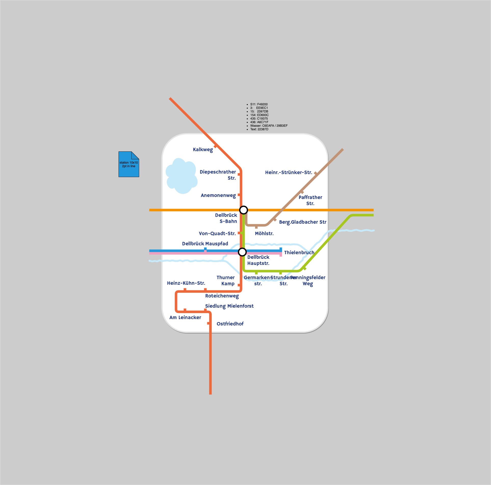
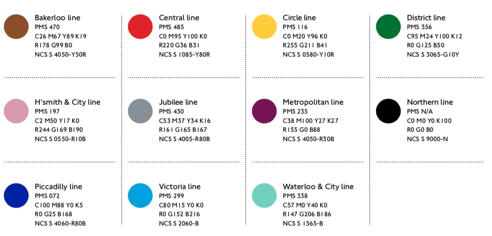
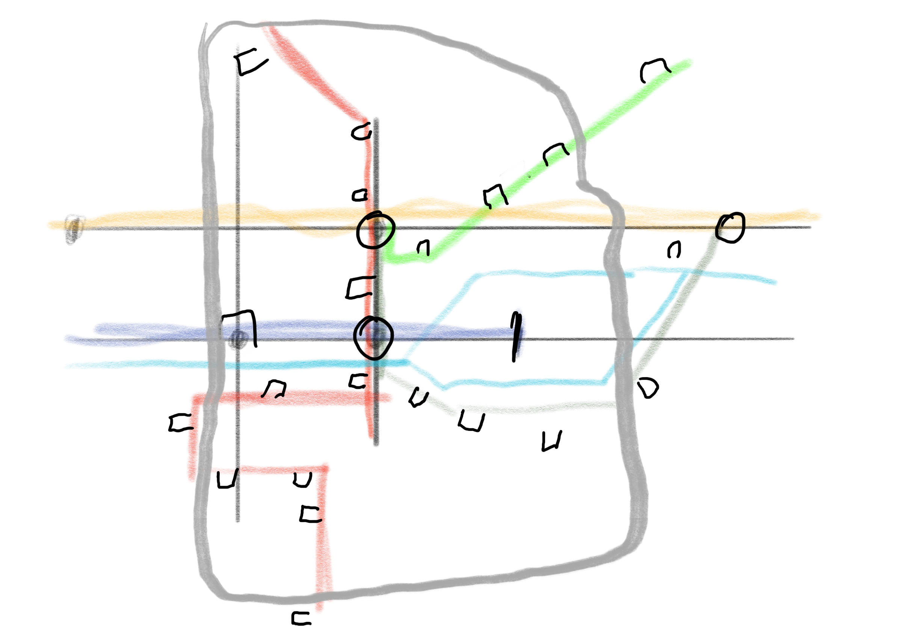
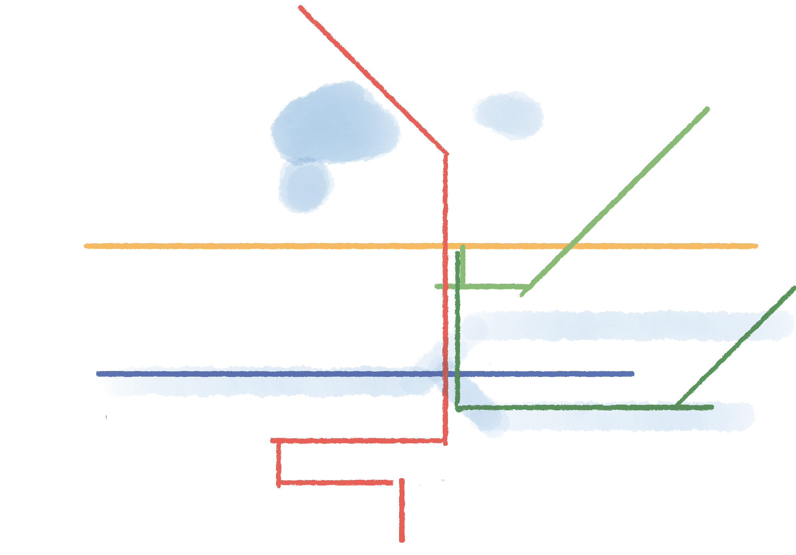

# DellTube

kleines Projekt zum Ausprobieren verschiedener Möglichkeiten, per draw.io eine an die London Tube Map angelehnte Karte der öffentlichen Verkehrsmittel in meinen Stadtteil zu machen.

## aktuelle Version

## Vorlagen

Als Schriftart wird Cabin verwendet, welche als freie Schriftart an die original Schriftart erinnert.

Die Farben stammen aus der TubeMap:

## erste Skizzen

Als Vorlage diente eine spezille Version von openstreetmap, die öpnvkarte,  welche dann vereinfacht abgezeichnet wurde, um die umgefähre Lage zueinander abschätzen zu können:

Die nächste Skizze ist eine weiter reduzierte Version (fast ein Kunstwerk)

## Links

- https://www.draw.io/
- https://tfl.gov.uk/maps/track/tube
- http://www.xn--pnvkarte-m4a.de/#7.0746;50.9736;15
- https://fonts.google.com/specimen/Cabin