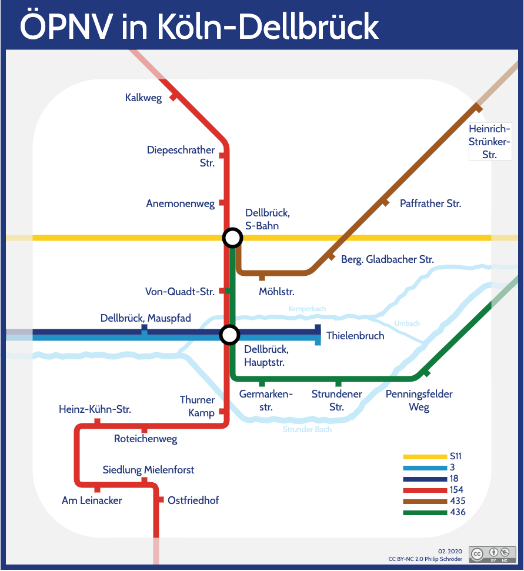

# DellTube

kleines Projekt zum Ausprobieren verschiedener Möglichkeiten, per draw.io[^1] eine an die London Tube Map[^2] angelehnte Karte der öffentlichen Verkehrsmittel in meinen Stadtteil zu machen.

Als Schriftart wird Hammersmith One [^5] verwendet, welche als freie Schriftart an die original Schriftart erinnert.

## aktuelle Version

## erste Skizzen

Als Vorlage diente eine spezille Version von openstreetmap, die öpnvkarte [^3],  welche dann vereinfacht abgezeichnet wurde, um die umgefähre Lage zueinander abschätzen zu können:

Die nächste Skizze ist eine weiter reduzierte Version (sozusagen das Kunstwerk)

## Links

[^1]: https://www.draw.io/
[^2]: https://tfl.gov.uk/maps/track/tube
[^3]: http://www.xn--pnvkarte-m4a.de/#7.0746;50.9736;15
[^5]: https://fonts.google.com/specimen/Hammersmith+One

